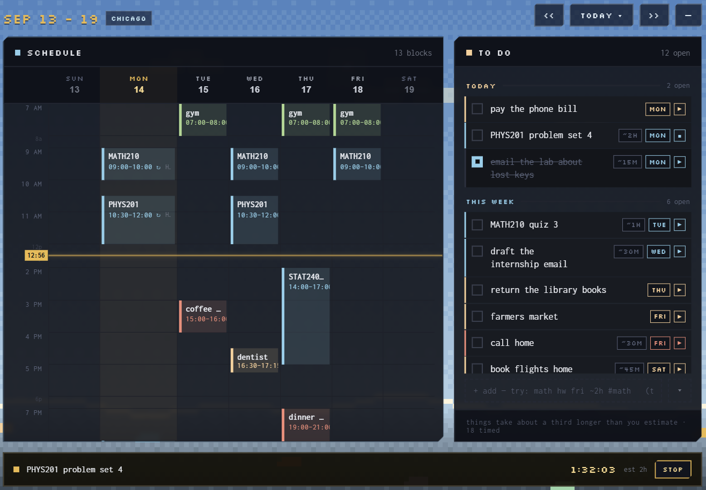
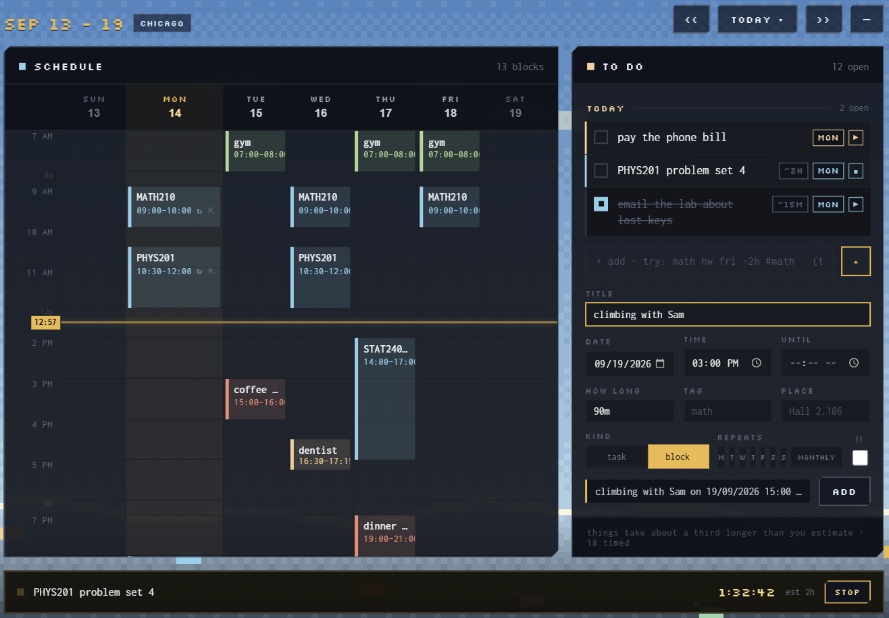

# Marwan's Schedule

A weekly planner that exists to do the three things paper cannot: keep recurring
commitments without rewriting them, time work against your estimate, and be in
your pocket.



Design: [`docs/superpowers/specs/2026-08-29-marwans-schedule-design.md`](docs/superpowers/specs/2026-08-29-marwans-schedule-design.md)
Parser contract: [`docs/parser-behaviour.md`](docs/parser-behaviour.md) — what it
should and should not understand, every case verified against the code by
`python tools/behaviour_check.py`
Agent instructions: [`AGENT.md`](AGENT.md) — the import format, where run
files go, and the PowerShell invocations that actually work

## Adding things

Type a line and it is parsed. If you cannot remember the syntax, the `⌄` beside
the capture box opens fields instead — and shows you the line they compose, so
you need it less each time. Both go through the same parser; the form has no
private path into the store.

The Telegram bot asks for whatever you left out, one thing at a time, and `-`
skips any of it. A complete line is never questioned.

## Two gestures worth knowing

Clicking an empty hour opens those same fields with its date and time already
filled in, as a block.

Blocks already on the week can be dragged to another time or day, and pulled
longer or shorter by their bottom edge. Dragging one occurrence of a repeating
class moves **only that week** — the series is left alone, and restoring the
date removes the moved copy so the class never appears twice.



Screenshots are of invented data, produced by
[`tools/frontend-harness`](tools/frontend-harness) rather than anyone's real week.

## Layout

```
core/          all logic: schema, week expansion, parser, timer, stats, import
cli/           `sched` — the command line, and what an agent drives
bot/           `msbot` — Telegram capture (a separate process you opt into)
app/           the Tauri window: src-tauri (commands) + src (frontend)
```

Everything goes through `core`. The window, the CLI and the bot are three front
doors onto one store and one grammar, so they cannot drift apart.

## Build

```sh
cargo build --release
```

Binaries land in `target/release/`: `marwans-schedule.exe`, `sched.exe`,
`msbot.exe`.

## Run

```sh
cargo run -p marwans-schedule      # the window
sched add "math hw fri ~2h #math"  # capture from a terminal
sched help                         # syntax
msbot                              # Telegram capture, needs a token
```

All three share one database at `%APPDATA%\com.marwan.schedule\schedule.db`
(SQLite, WAL). Override with `SCHEDULE_DB`, or `sched --db <path>`.

## Living in the tray

The window opens maximised and borderless — windowed fullscreen, not exclusive,
so alt-tab and overlays behave normally.

- **Ctrl+Alt+S** summons it, and puts it away again if it is already in front.
- **Esc** hides it. So does closing it: the window goes to the tray rather than
  quitting, which is the point of a thing that is always one key away.
- The tray icon toggles on left click and has Open / Quit on right click.

The background canvas stops drawing the moment the window hides — Rust emits
`window:hidden` explicitly, because a hidden native window does not reliably
fire `visibilitychange` and a loop running behind a game is the exact problem
this app was rebuilt to avoid.

### Launch at login

The app enables it for itself on first run, and starts hidden with `--hidden`
so it sits in the tray instead of appearing over whatever you were doing.

To turn it off: Settings → Apps → Startup, or delete the
`marwans-schedule` entry under
`HKCU\Software\Microsoft\Windows\CurrentVersion\Run`.

The bot is separate, because it is a console program: a
`msbot.vbs` in the Startup folder launches it with no console window. Delete
that file to stop it.

## The Telegram bot

It needs a token from [@BotFather](https://t.me/BotFather), supplied either way:

```sh
set TELEGRAM_TOKEN=...
```

or a line in `%APPDATA%\com.marwan.schedule\bot.toml`:

```toml
token = "..."
```

That file is gitignored. 

### Reminders

Ten minutes before anything on the week starts, or anything in the list falls
due, the bot pushes a message. There is nothing to switch on: it sends to
whichever chat last spoke to it, so say anything once and reminders begin.

The check runs at the top of every poll, which is at most 50 seconds apart, so
a reminder lands between nine and ten minutes ahead rather than exactly ten.
Every notice sent is recorded in the store, so a restart cannot repeat one, and
a block you move announces itself again at its new time.

To see what is coming without waiting for it:

```sh
cargo run -p ms-core --example notify_preview -- 60
```

The bot is a **separate process on purpose**. The app runs no background
services; this is one you start when you want it. Messages sent while it is down
are delivered when it comes back — Telegram queues them for 24 hours.

## Syntax

Plain text always works. Anything the parser does not recognise stays in the
title, so ordinary sentences are safe.

```
renew parking
math hw fri 5pm ~2h #math
trash every tue 20:00
MATH210 every mon wed 9:00-10:15 @Hall 1.204
vitamins daily 08:00
rent monthly 1 oct 9am
!! renew parking tomorrow
```

Run `sched help` for the full reference; the app and the bot print the same text
from the same function, and a test asserts every example in it actually parses.

## Tests

```sh
cargo test
```

153 tests. The ones worth knowing about:

- `fuzz_totality` — 4,000 seeded cases of malformed data against every tzdata
  zone, asserting `get_week` never panics.
- `defects` — regressions for bugs found after the fact: DST duration, calendar
  bounds, zone aliases, silent store failures.
- `expansion` — recurrence, exceptions, and the spec's error catalogue.
- `parser` — including the cases that must **not** parse, which matter more than
  the ones that do.
- `notify` — what gets pushed and, more to the point, what does not: a block
  already begun, an occurrence already ticked, a notice already sent.
